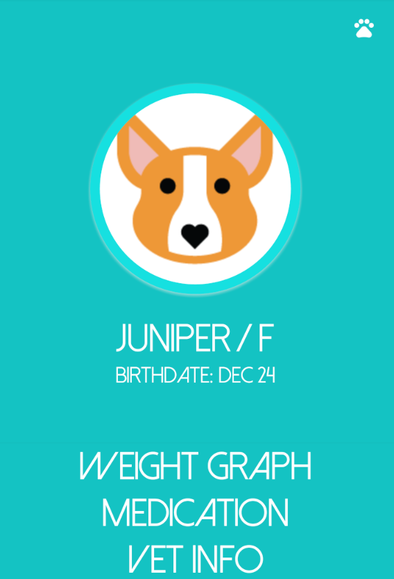

# PetTracker
####_Joanna Anderson_

##Description
An android app to keep track of your pets. Allows users to keep track of pet's medication and weight. Users are also able to search for vets nearby. The app utilizes the Yelp API to find vets near the user.

## Installation
**To download the project**
* `git clone https://github.com/saeromjoa/pettracker2` this repository
* Open Android Studio
* Open directory `PetTracker2`

##Technologies Used
* Java
* Android Studio
* XML

### License
Copyright (c) 2016 **_Joanna Anderson_**
